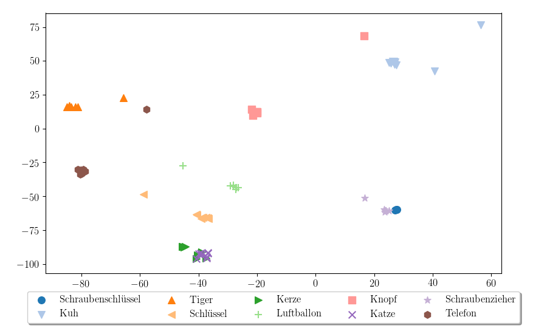

# Thesis

Development of a machine learning solution for automated response detection and localization for a clinical picture naming test.

# Description

This repository contains the complete source code of a keyword spotting system developed as part of my Master's thesis.
The aim of the project was to provide a simple solution which is able of finding occurrences of specific German words in recordings
of aphasic patient's verbal answers to picture prompts and can work efficiently on low-capability hardware (like a laptop). 

The developed approach uses a Siamese-like recurrent neural network to produce fixed-size embeddings 
of variable-length speech segments (representing spoken words) trained in such a way that same-word segments are close in the embedding space.
The embedding network is then used on novel audio to find segments best corresponding to expected picture names, accepting the 
matches based on a predefined distance threshold. 

    

A t-SNE projection of embeddings of several word segments from the validation dataset (previously unseen by the network), 
each point represents a different spoken example of the specified word.  

We can see that word clusters are fairly well separated, and similarly sounding words tend to be closer to each other in the embedding space than to other word examples 
(Schraubenzieher and Schraubenschlüssel are close, but separable, while the network fails to distinguish between Kerze and Katze).  

    

A t-SNE projection of embeddings of examples of completely new word categories shows that the network can generalize 
to previously unseen vocabulary.    

For more details please refer to the [thesis pdf](Master's_thesis_Zhelo.pdf).

# Requirements

## [PyTorch](https://github.com/pytorch/pytorch)

## [R](https://www.r-project.org/)
The emuDB dataset preparation script reads segment lists generated
using the R language and the library emuR to extract isolated word audio features.

## [Kaldi](https://github.com/kaldi-asr/kaldi)
Necessary for the IO toolkit.

## [kaldi-io-for-python](https://github.com/vesis84/kaldi-io-for-python/)
Set up access to kaldi_io.py as suggested in 
[issue 9](https://github.com/vesis84/kaldi-io-for-python/issues/9).

## [python-speech-features](https://github.com/jameslyons/python_speech_features)

## [WebRTC VAD](https://github.com/wiseman/py-webrtcvad)
Not strictly required for the final pipeline, but could be used to improve the detected keyword segments.

## Miscellaneous
* NumPy 
* SciPy 
* scikit-learn 
* pandas
* Matplotlib
* rpy2 
* soundfile
* resampy
* lxml
* cachetools
* speechpy

# Workflow

1. Set the data paths in conf.py.
2. Training is done on pre-extracted features, if these are not already available run the emuDB.py,
snodgrass.py and SWC.py scripts in dataset_prep, prepare a train/dev/test split using the split_train_dev_test.py 
script, and write the new dataset path into the current_dataset field of conf.py.  
3. Adjust the embedding network options in acoustic_word_embeddings/configs/conf.ini.
4. Run the train scripts in acoustic_word_embeddings.
5. Use the rs_new_data.py script to generate response detections for one or more sessions from a single patient.

Run
`python acoustic_word_embeddings/analysis/log_investigator.py RUNS_DIR`
to print summaries of one or more training runs in a specific folder, and
`python acoustic_word_embeddings/analysis/checkpoint_remover.py RUNS_DIR`
to remove the checkpoints of all but the best three epochs for each run in this folder.
